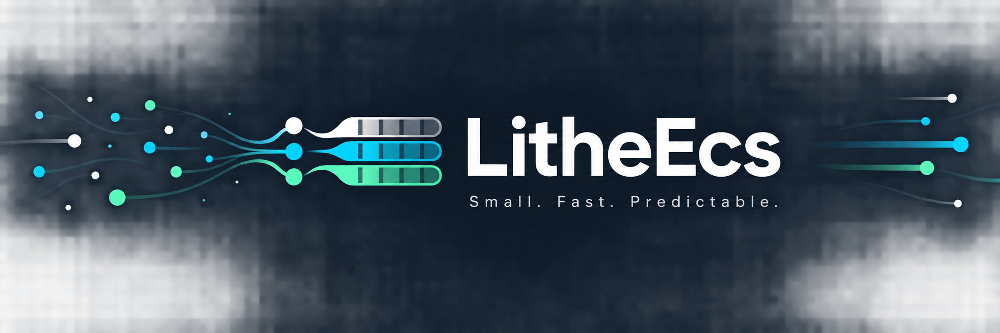

# LitheEcs

日本語 | [English](README.md) | [APIリファレンス](LitheEcs/API.ja.md)

LitheEcsは、Unityから自然に利用できることを目指した、小さく高速なManaged C# Entity Component Systemです。
予測しやすいAPI、Archetypeによる連続ストレージ、allocation-freeな反復処理、マネージドオブジェクトとの明示的な連携を重視しています。

> [!IMPORTANT]
> LitheEcsは現在開発中です。最初の安定版までにAPIが変更される可能性があります。

## 特徴

- .NET Standard 2.1 / C# 9対応のManaged Archetype ECS
- marker interfaceを必要としない通常の`struct` Component
- Componentの連続ストレージとallocation-freeな型付きQuery
- 1～8 Componentの型付きQuery
- delegate間接呼び出しを避けるstruct Query Action
- `AsParallelQuery()`によるManaged並列Range Query
- Spawn、Despawn、Component追加・削除の一括処理
- 頻出するEntity構成を再利用する`EntityTemplate`
- Index再利用をVersionで保護するgenerational Entity handle
- `ISingleton` marker Componentで識別するSingleton Entity
- 順方向・逆方向のEntity Relation
- 外部objectや値からEntityを逆引きするBinding
- 構造変更を遅延実行するEntity Command Buffer
- Component変更CollectorとDebug用診断API
- 遅延確保overflowにより256を超えるComponent型IDへ対応

## 動作要件

- Unity 2022.3 LTS以降、または.NET Standard 2.1互換Runtime
- C# 9以降
- リポジトリのビルドと現在のテストプロジェクトには.NET SDK 10

## 導入

Unityでは **Window > Package Manager** を開き、**Add package from git URL** から次を入力します。

```text
https://github.com/kurobon-jp/LitheEcs.git?path=/UnityPackage
```

.NETプロジェクトでは、このリポジトリをcloneしてSolutionをビルドしてください。

```powershell
cd LitheEcs
dotnet build LitheEcs.sln --configuration Release
```

その後、.NETプロジェクトから`LitheEcs/LitheEcs.csproj`を参照します。

## 最小例

```csharp
using LitheEcs;

public struct Position
{
    public float X;
    public float Y;
}

public struct Velocity
{
    public float X;
    public float Y;
}

using var world = new World(defaultCapacity: 1_000);

var entity = world.Spawn();
entity.Add(new Position { X = 10, Y = 20 });
entity.Add(new Velocity { X = 1, Y = -2 });

foreach (var (position, velocity) in world.Query<Position, Velocity>())
{
    position.Value.X += velocity.Value.X;
    position.Value.Y += velocity.Value.Y;
}
```

Queryから取得したComponentへの参照は、対象Storageが構造変更されるまで有効です。Queryの実行中はWorldを直接構造変更できません。EntityのSpawn・DespawnやComponentの追加・削除が該当します。Queryの`ref`を通した既存Component値の更新は可能です。構造変更は`EntityCommandBuffer`へ記録し、Query完了後に`Playback()`してください。

## クエリの使い分け

Componentだけが必要な場合は直接列挙します。

```csharp
foreach (ref var position in world.Query<Position>())
    position.X += 1;
```

Hot pathでEntityとComponentの両方が必要な場合はstruct actionを使用します。

```csharp
public struct Integrate : IQueryAction<Position, Velocity>
{
    public void Execute(in Entity entity, ref Position position, ref Velocity velocity)
    {
        position.X += velocity.X;
        position.Y += velocity.Y;
    }
}

var integrate = new Integrate();
world.Query<Position, Velocity>().ForEach(ref integrate);
```

Component列ではなくEntityの集合を取得したい場合は`EntityQuery`を使用します。

```csharp
foreach (var entity in world.Query().With<Position>().Without<Disabled>())
    Process(entity);
```

Componentの一括処理には型付きComponent Queryを推奨します。Entityごとに`entity.Get<T>()`を呼ぶと、Entityの検証とComponent位置の再検索が必要になります。

## Parallel Query

十分なEntity数があり、各Entityを独立して処理できる場合は`AsParallelQuery()`を使用します。型付きQueryをRangeへ分割し、Worldが所有するManaged worker threadでRangeごとのcallbackを実行します。

```csharp
world.Query<Position, Velocity>()
    .Without<Disabled>()
    .AsParallelQuery(minimumEntityCount: 4_096, batchSize: 4_096)
    .Run((positions, velocities, entities) =>
    {
        for (var i = 0; i < positions.Length; i++)
        {
            positions[i].X += velocities[i].X;
            positions[i].Y += velocities[i].Y;
        }
    });
```

callbackには、対応するComponentの`Span<T>`と`EntityRange`が渡されます。対象Entity数が`minimumEntityCount`未満の場合は、同じcallbackを呼び出し元のthreadで逐次実行します。`minimumEntityCount`と`batchSize`の既定値はいずれも4,096です。

各callbackは自身のRange内にあるComponentを更新できますが、捕捉した共有状態へのアクセスは利用者側で同期してください。Parallel Queryの同時実行・ネストや、実行中の構造変更はできません。現在の`EntityCommandBuffer`は所有thread専用なので、構造変更要求を安全に収集し、`Run()`完了後に記録してください。このAPIはManaged thread用であり、Unity Job SystemやBurst用ではありません。

## Entityのライフサイクル

```csharp
var entities = new Entity[1_000];
world.SpawnBatch(entities.Length, entities);

world.AddComponentBatch(entities, new Position());
world.DespawnBatch(entities);
```

同じ構成を繰り返し生成する場合はTemplateを使用します。

```csharp
var projectile = world.CreateTemplate()
    .Add(new Position())
    .Add(new Velocity { X = 20 });

Entity one = projectile.Spawn();
projectile.SpawnBatch(100);
```

## Singleton Entity

```csharp
public struct GameSession : ISingleton { }

var session = world.Spawn();
session.Add<GameSession>();
session.Add(new Score());

Entity resolved = world.Singleton<GameSession>();
```

SingletonなのはEntityです。同じEntityにある通常ComponentまでSingleton扱いにはなりません。

## 外部オブジェクト・値のバインディング

```csharp
entity.Bind(gameObject);

if (world.TryGetEntity(gameObject, out var boundEntity))
    Use(boundEntity);
```

class keyは参照同一性、struct keyは値の等価性で識別します。structのBindingと逆引きは、定常状態ではboxingを行いません。EntityのDespawn時にBindingは自動解除されます。

## `Link<T>`によるマネージド参照

Managed参照をComponentとして保持する`Link<T>`はBindingとは別機能です。

```csharp
entity.Add(Link.With(gameObject));
```

## Relation

```csharp
public struct ParentOf { }

parent.AddRelation<ParentOf>(child);

foreach (var target in parent.GetRelations<ParentOf>())
    Use(target);

foreach (var source in world.GetEntitiesWithTarget<ParentOf>(child))
    Use(source);
```

Relationは順方向と逆方向を追跡し、関係するEntityのDespawn時に自動削除されます。

## コンポーネント変更の監視

`EntityCollector`を使うと、前回の`Clear()`以降に発生したComponentイベントを処理できます。

```csharp
using var healthChanges = world
    .Observe<Health>(ComponentEvent.KeyAdded | ComponentEvent.KeyChanged)
    .Or<Dead>(ComponentEvent.KeyRemoved);

foreach (var entity in healthChanges)
{
    if (entity.IsAlive)
        Process(entity);
}

healthChanges.Clear();
```

複数の監視イベントが発生しても、同じEntityは一度だけ収集されます。Component削除やDespawnのイベントでは、処理時にEntityがAliveでない場合があるため、必要に応じて`IsAlive`を確認してください。購読解除のためCollectorは破棄する必要があり、`using`の使用を推奨します。

## `EntityCommandBuffer`による構造変更の遅延実行

```csharp
var commands = world.CommandBuffer;

world.Query<Health>().ForEach(
    (in Entity entity, ref Health health) =>
    {
        if (health.Value <= 0)
            commands.Despawn(entity);
    });

commands.Playback();
```

## 謝辞

LitheEcsは[Friflo.Engine.ECS](https://github.com/friflo/Friflo.Engine.ECS)と[fennecs](https://github.com/outfox/fennecs)からインスピレーションを受けています。両プロジェクトのアイデアを参考にしつつ、LitheEcs独自の目標とUnityでのユースケースに合わせてAPIを設計しています。
